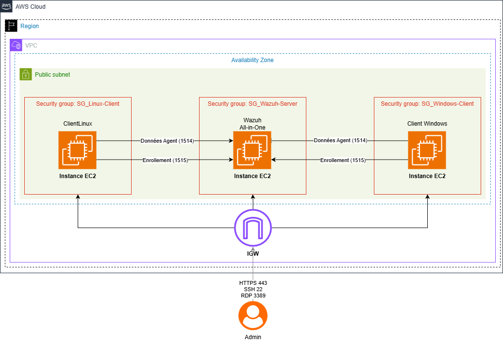

# Sécurité des Endpoints et Supervision SIEM : Étude de Cas Multi-OS


## Table des Matières

- [À Propos](#à-propos)
- [Architecture](#architecture)
- [Installation et Déploiement](#installation-et-déploiement)
- [Démonstrations](#démonstrations)
- [Threat Hunting](#threat-hunting)
- [Concepts Clés](#concepts-clés)

## À Propos

Ce projet implémente une solution complète de supervision et de sécurité des systèmes informatiques utilisant **Wazuh** comme plateforme SIEM/EDR. Il permet la détection, l'analyse et la réponse aux menaces sur des environnements multi-OS (Linux et Windows) déployés sur AWS.

### Objectifs

- Mise en place d'une architecture de sécurité centralisée avec Wazuh
- Supervision en temps réel des événements de sécurité sur Linux et Windows
- Détection des tentatives d'intrusion et des comportements suspects
- Implémentation des bonnes pratiques IAM et PAM
- Chasse proactive aux menaces (Threat Hunting)

## Architecture

### Vue d'Ensemble

### Composants

| Composant | Type EC2 | OS | Rôle |
|-----------|----------|-----|------|
| **Wazuh Server** | t3.large | Ubuntu 22.04 LTS | Centralisation, corrélation et analyse des événements |
| **Client Linux** | t2.micro | Ubuntu 22.04 LTS | Endpoint supervisé pour tests Linux |
| **Client Windows** | t3.medium | Windows Server 2025 | Endpoint supervisé pour tests Windows |

### Groupes de Sécurité

#### SG_Wazuh-Server
- `22/TCP` : SSH (depuis IP admin)
- `443/TCP` : Dashboard Wazuh (depuis IP admin)
- `1514/TCP` : Réception logs (depuis SG clients)
- `1515/TCP` : Enrôlement agents (depuis SG clients)

#### SG_Linux-Client
- `22/TCP` : SSH (depuis IP admin)

#### SG_Windows-Client
- `3389/TCP` : RDP (depuis IP admin)

## Installation et Déploiement

### Étape 1 : Création des Instances EC2

#### 1.1 Serveur Wazuh

```bash
# Connexion à AWS Console
# EC2 > Launch Instance

Nom: Wazuh-Server
AMI: Ubuntu Server 22.04 LTS (HVM), SSD Volume Type
Type d'instance: t3.large
Paire de clés: Créer ou sélectionner une clé (ex: vockey.pem)
```

**Configuration réseau:**
- Créer un Security Group `SG_Wazuh-Server`
- Ajouter les règles entrantes mentionnées ci-dessus

#### 1.2 Client Linux

```bash
Nom: Linux-Client
AMI: Ubuntu Server 22.04 LTS (HVM), SSD Volume Type
Type d'instance: t2.micro
Paire de clés: Même clé que le serveur
Security Group: SG_Linux-Client (22/TCP)
```

#### 1.3 Client Windows

```bash
Nom: Windows-Client
AMI: Windows Server 2025 Base
Type d'instance: t3.medium
Paire de clés: Même clé que le serveur
Security Group: SG_Windows-Client (3389/TCP)
```

### Étape 2 : Installation du Serveur Wazuh

#### 2.1 Connexion au Serveur

```bash
# Récupérer l'IP publique depuis AWS Console
ssh -i "vockey.pem" ubuntu@<IP_PUBLIQUE_WAZUH>
```

#### 2.2 Installation de Wazuh

```bash
# Mise à jour du système
sudo apt update && sudo apt upgrade -y

# Installation de curl
sudo apt install curl -y

# Téléchargement du script d'installation Wazuh
curl -sO https://packages.wazuh.com/4.x/wazuh-install.sh

# Exécution de l'installation (all-in-one)
sudo bash wazuh-install.sh -a

# Sauvegarder les identifiants affichés à la fin !
# Username: admin
# Password: <mot_de_passe_généré>
```

#### 2.3 Vérification de l'Installation

```bash
# Vérifier le statut des services
sudo systemctl status wazuh-manager
sudo systemctl status wazuh-indexer
sudo systemctl status wazuh-dashboard

# Récupérer l'IP privée du serveur (pour les agents)
hostname -I
```

#### 2.4 Accès au Dashboard

```
https://<IP_PUBLIQUE_WAZUH>
Username: admin
Password: <mot_de_passe_sauvegardé>
```

### Étape 3 : Installation de l'Agent sur Client Linux

#### 3.1 Connexion au Client Linux

```bash
ssh -i "vockey.pem" ubuntu@<IP_PUBLIQUE_LINUX_CLIENT>
```

#### 3.2 Déploiement de l'Agent

```bash
# Télécharger et installer l'agent
wget https://packages.wazuh.com/4.x/apt/pool/main/w/wazuh-agent/wazuh-agent_4.7.5-1_amd64.deb && sudo WAZUH_MANAGER='IP_PRIVEE_WAZUH_SERVER' WAZUH_AGENT_NAME='Linux-Client' dpkg -i ./wazuh-agent_4.7.5-1_amd64.deb

# Démarrer l'agent
sudo systemctl daemon-reload
sudo systemctl enable wazuh-agent
sudo systemctl start wazuh-agent

# Vérifier le statut
sudo systemctl status wazuh-agent
```

### Étape 4 : Installation de l'Agent sur Client Windows

#### 4.1 Connexion au Client Windows

```bash
# Télécharger le fichier RDP depuis AWS Console
# Obtenir le mot de passe Windows avec votre clé privée
# Se connecter via RDP
```

#### 4.2 Déploiement de l'Agent

**Dans PowerShell (Administrateur):**

```powershell
# Télécharger l'installateur Wazuh
Invoke-WebRequest -Uri https://packages.wazuh.com/4.x/windows/wazuh-agent-4.x.x-1.msi -OutFile wazuh-agent.msi
msiexec.exe /i wazuh-agent.msi /q WAZUH_MANAGER="IP_PRIVEE_WAZUH_SERVER" WAZUH_AGENT_NAME="Windows-Client"

# Démarrer le service
NET START WazuhSvc
```
### Étape 5 : Vérification des Agents

Retourner sur le Dashboard Wazuh:

1. Aller dans **Endpoints Summary**
2. Vérifier que les deux agents apparaissent avec le statut "Active"
3. Cliquer sur chaque agent pour voir les détails

## Démonstrations

### Simulation d'Attaque par Force Brute (Linux)

```bash
# Depuis une machine externe
for i in {1..10}; do
  ssh fakeuser@<IP_CLIENT_LINUX>
done
```

**Résultat attendu:** Alertes de niveau 5, puis niveau 10 sur le Dashboard

### Simulation d'Élévation de Privilèges (Linux)

```bash
# Sur le client Linux
sudo su
```

**Résultat attendu:** Alertes PAM et sudo dans les événements de sécurité

### Simulation d'Échecs d'Authentification (Windows)

1. Ouvrir le fichier RDP du client Windows
2. Saisir un mot de passe incorrect 5 fois

**Résultat attendu:** Alertes d'authentification échouée sur le Dashboard

### Simulation de Création d'Utilisateur Admin (Windows)

```powershell
# Dans PowerShell (Administrateur)
net user labuser P@ssw0rd123! /add
net localgroup Administrators labuser /add
```

**Résultat attendu:** Alertes de création de compte et modification de groupe

## Threat Hunting

### Requêtes Utiles

#### Échecs d'Authentification Windows

```
agent.name:"Windows-Client" AND rule.groups:"authentication_failed"
```

#### Modifications de Groupes Windows

```
agent.name:"Windows-Client" AND rule.groups:"group_changed"
```

#### Élévations de Privilèges Linux

```
agent.name:"Linux-Client" AND rule.groups:"sudo"
```

#### Toutes les Alertes Critiques

```
rule.level:>=10
```
## Concepts Clés

### SIEM vs EDR

| Critère | SIEM | EDR |
|---------|------|-----|
| **Couverture** | Infrastructure entière | Endpoints uniquement |
| **Objectif** | Centralisation et corrélation | Détection et réponse locale |
| **Détection** | Basée sur les logs | Basée sur le comportement |
| **Réponse** | Alertes centralisées | Réponse automatisée |

### IAM et PAM

- **IAM** (Identity and Access Management) : Gestion centralisée des identités et droits
- **PAM** (Privileged Access Management) : Sécurisation des comptes à privilèges élevés
